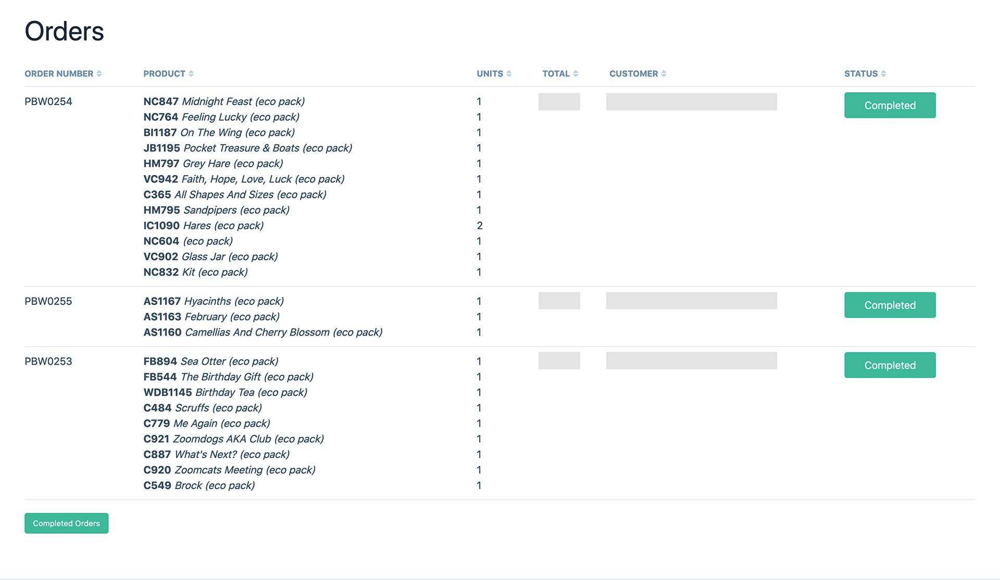
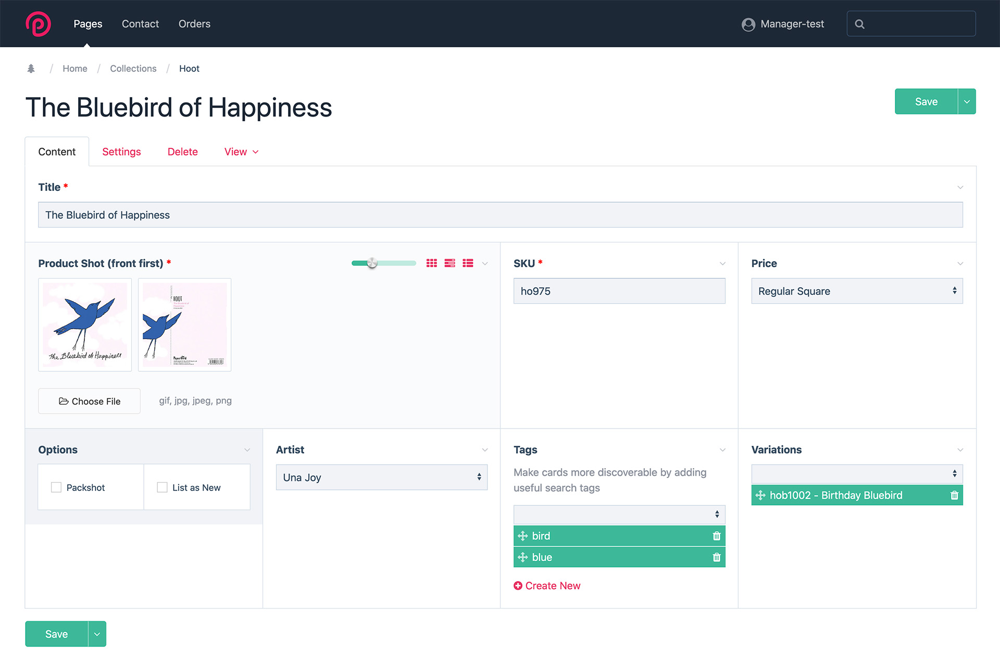
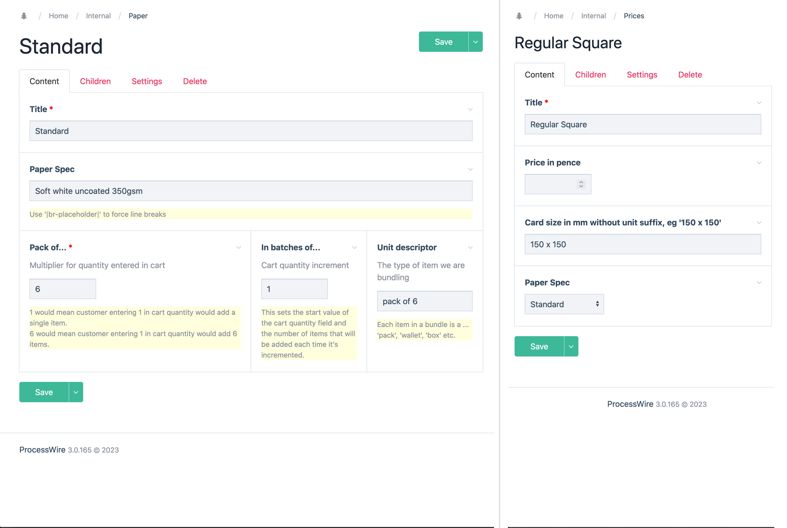

# Paperbird Publishing Website

  

  ## Table of Contents

  [Description](#description) [Installation](#installation) [Usage](#usage) [Contributing](#contributing) [Tests](#tests) [License](#license) [Questions](#questions) 

  ## Description

  Online catalogue with integrated wholesale order system for trade customers  
 *Paperbird homepage*  
  The site is built in PHP using the [Processwire](https://processwire.com/) content management system. Common page elements are defined as modular components and the front end of the site makes use of jQuery with styles written in SASS using the [BEM methodology](https://en.bem.info/methodology/).  Retailers can apply for an account via the [customer registration form](https://www.paperbirdpublishing.co.uk/register/), and once approved can log into the front end, view products with prices displayed and add and remove cart items.  *Logged in customers have access to product prices and cart functionality*  Product images are lazy loaded by the [LazyResponsiveImages module](https://github.com/paulashby/LazyResponsiveImages) which provides HTML5 image srcsets with appropriate image variations. The cart functionality is provided by the [OrderCart](https://github.com/paulashby/OrderCart) module. Orders can be placed directly from the cart, and when submitted, the customer is sent a notification email.  A search bar allows customers to quickly find products by artist name or keyword and a contact form is provided for customer queries.  The back end of the site allows store managers to handle both orders and contact form submissions. Order functionality is provided by the [ProcessOrderPages module](https://github.com/paulashby/ProcessOrderPages). Pending orders are listed on the Orders page and when forwarded to the print-per-order service are tagged as processed. Fulfilled orders are tagged as completed and removed from the system.  *The order listing page*   The product page accepts supplementary information such as search tags and allows existing product variations to be linked to via a dynamically populated select menu.  *Price category and artist can be assigned to products via dynamic select menus*  *Once configured, paper specs (left) can be applied to multiple price categories (right)*  A paper spec can be used by mutliple price categories and defines paper stock and order quantity information. Defining price category and paper spec separately allows the latter to be updated for multiple price categories in a single operation.  Form submissions are managed on the Contact page which is generated by the [ProcessContactPages module](https://github.com/paulashby/ProcessContactPages). Here customers' messages can be tagged as Processed or Resolved and registration applications accepted or rejected.  The live site can be viewed [here](https://www.paperbirdpublishing.co.uk/)
  
  ## Installation
  
  Although the site itself is not intended to be used as a shared resource, you may be interested in making use of the modules. If so, please follow the installation instructions in their respective repositories. 
- [ProcessOrderPages](https://github.com/paulashby/ProcessOrderPages)
- [LazyResponsiveImages](https://github.com/paulashby/LazyResponsiveImages)
- [OrderCart](https://github.com/paulashby/OrderCart)
- [ProcessContactPages](https://github.com/paulashby/ProcessContactPages) 
  
## Usage
  
  N/A
  
  ## Contributing
  
  If you would like to make a contribution any of the modules, simply fork the relevant repository and submit a Pull Request. If I like it, I may include it in the codebase.
  
  ## Tests
  
  N/A
  
  ## License
  
  None
  
  ## Questions
  
  Feel free to [email me](mailto:paul@primitive.co?subject=Paperbird%20Publishing%20Website%20query%20from%20GitHub) with any queries.